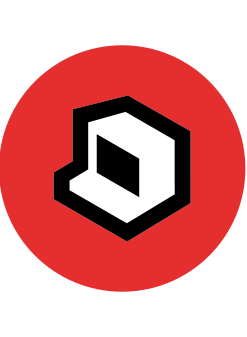
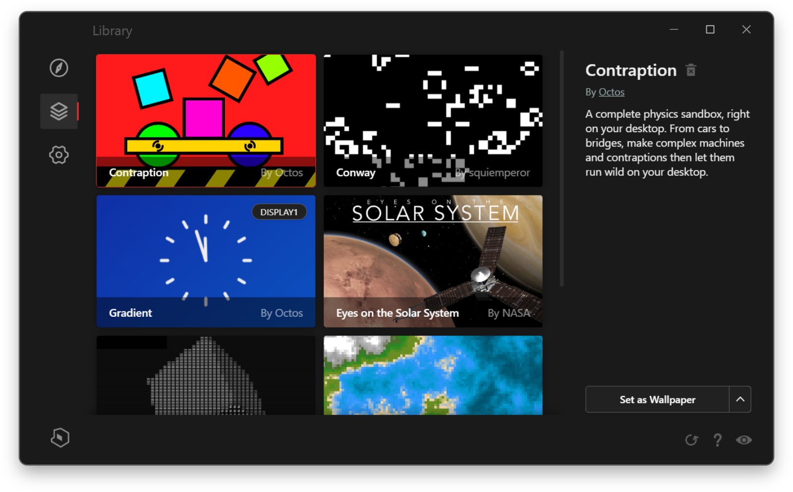

# Octos: HTML Dynamic Desktop Engine

### HTML-powered dynamic desktop engine
Create live, interactive wallpapers with HTML/CSS/JS for Windows 10 & 11

**[Website](https://underpig1.github.io/octos) | [Docs](https://underpig1.github.io/octos/guides) | [Download]()**

## Quickstart
Download the latest installer for Windows 10 & 11: [**OctosSetup.exe**](https://github.com/underpig1/octos/releases/latest/download/OctosSetup.exe)

Or download from the Microsoft Store: [**Microsoft Store Page**]()

## Features
|||
|-|-|
|**Quick and easy customization**|Creating your own live, interactive wallpapers has never been easier.|
|**Any and all web technology**|Supports games, websites, videos, and pretty much any other interactive web-based content for your wallpaper.|
|**Performant and lightweight**|Optimized for web technologies on the desktop through WebView2. Designed to run smoothly for any machine, from beefed-up PCs to battery-powered laptops.|
|**Powered by the Octos API**|Add music visualizations, media controls, and other native Windows features to your desktop through JavaScript with the Octos API.|
|**Free and open-source**|Community contributions are welcome!|
|**Octos Community**|Create and share your wallpapers for the world to download from the app.|
|**Multi-monitor support**|Customize multiple monitors easily in the Octos app.|

## Octos Desktop App
Customize your desktop, download community wallpapers, and more, all from the Octos desktop app. Download for free on Windows 10 & 11.

<!-- ## Octos Studio
Easily personalize your desktop with this interactive interface. -->

## [Octos API](https://underpig1.github.io/octos/guides/api/)
Elevate your wallpaper with the Octos API. Access music visualization data, synchronize across monitors and displays, add media controls, and so much more right on your desktop in JavaScript via the Octos API.

## [Octos Docs](https://underpig1.github.io/octos/guides/)
It's super easy to get started making your own wallpapers for Octos. Check out the docs for a quick getting started guide.

## [Octos Community](https://github.com/underpig1/octos-community/tree/master)
Join the Octos community to share your wonderful creations with the world! It's easy to make and share HTML wallpapers with Octos.