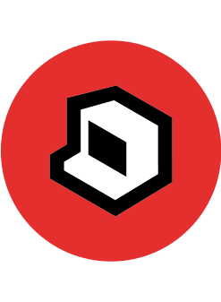

# Octos: HTML Dynamic Desktop Engine
### HTML-powered dynamic desktop engine
Create animated and interactive wallpapers with HTML/CSS/JS for Windows 10 & 11

## Features
* **Quick and easy customization**: Creating your own live, interactive wallpapers has never been easier.
* **Any and all web technology**: Supports games, websites, videos, and pretty much any other interactive web-based content for your wallpaper. Even WebGL Unity games!
* **Performant and lightweight**: Optimized for web technologies on the desktop through WebView2.
* **Powered by the Octos API**: Interface with music, media, and other native Windows features from JavaScript through the Octos API.
* **Free and open-source**: Community contributions are welcome!
* **Octos Community**: Create and share your wallpapers for the world to download from the app.
<!-- * **Octos Studio**: No CS degree? No problem! The Octos app lets you visually customize your desktop with Octos Studio. -->
* **Multi-monitor support**: Customize multiple monitors easily in the Octos app.

## Octos Desktop App
Customize your desktop, download community wallpapers, and more, all from the Octos desktop app. Download for free on Windows 10 & 11.

## Octos Studio
Easily personalize your desktop with this interactive interface.

## Octos Community
Join the Octos community to share your wonderful creations with the world! It's ridiculously easy to make and share HTML wallpapers with Octos.

## Octos API
Elevate your wallpaper with the Octos API. Access music playback info from JavaScript to visualize music on the desktop, add a pause/play button to interact with music, and so much more.

## Octos Docs
It's super easy to get started making your own content for Octos. Check out the docs for a quick getting started guide.