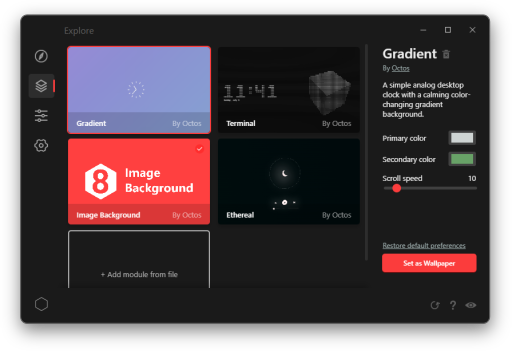

# Octos: HTML Live Wallpaper Engine

Create, distribute, and explore live, interactive wallpapers on Windows made with HTML, CSS, and JS.

## Table of contents

- Getting started
    - [Table of contents](?t=contents)
    - [Quickstart](?t=installation)
- Guides
    - [Making a mod](?t=making)
    - [Packaging a mod](?t=packaging)
    - [Publishing a mod](?t=publishing)
    - [Testing your mod](?t=testing)
    - [Using the CLI](?t=using-the-cli)
    - [Using the API](?t=using-the-api)
    - [mod.json](?t=mod-json)
    - [Widgets](?t=widgets)
- API Reference
    - [FileDialog](?t=file-dialog)
    - [FileSystem](?t=file-system)
    - [MediaController](?t=media-controller)
    - [UserPreferences](?t=user-preferences)
    - [Storage](?t=storage)
    - [system](?t=system)

## &#x1F6A7; Pardon the mess: thanks for testing out Octos!

Octos is currently in an early stage of development. To help out, consider [submitting a feature request or reporting an issue](https://github.com/underpig1/octos/issues/new). And of course, if you have an awesome wallpaper you made that you want to share, consider [publishing it](https://underpig1.github.io/octos/docs/?t=publishing) on the platform. As always, check out the [API docs](https://underpig1.github.io/octos/docs/?t=using-the-api) for resources and guides. Thanks!