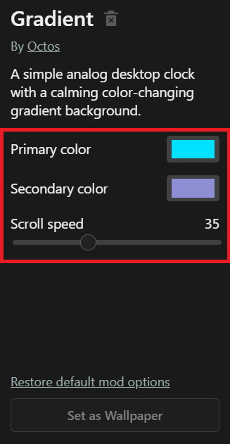

# `octos.json` Reference

Each mod folder can optionally include an `octos.json` file, which includes metadata, entry point, preview image, and user options.

## Example
`octos.json`:
```json
{
  "name": "My Awesome Mod",
  "author": "Me",
  "description": "A dynamic live wallpaper with interactive elements.",
  "image": "assets/image.png", // path to image to display in Octos explore page
  "preview": "assets/preview.gif", // path to preview image
  "entry": "index.html", // entry point, path to local HTML file or external webpage
  "options": { // user options, configurable in Octos app
    "enable-effect": {
      "type": "checkbox",
      "label": "Enable effect?",
      "value": true
    },
    "speed": {
      "type": "range",
      "label": "Speed",
      "min": 1,
      "max": 10,
      "value": 5
    }
  }
}
```

## Fields

### `author`
**Type:** `string`  
The author's name.

### `name`
**Type:** `string`  
Mod's display name.

### `description`
**Type:** `string`  
A short description of the mod' purpose or features.

### `image`
**Type:** `string`
Path to the card image to be shown in the Octos explore page.

### `entry`
**Type:** `string`  
The main HTML entry point that launches the wallpaper. Can either be a local HTML file or an external webpage.

### `options`
**Type:** `object`  
A JSON object that defines one or more **customizable settings** that can be changed by users of your mod in the Octos app:



These settings, along with input change event listeners, can be accessed in JS with the [`UserOptions` class](../reference/useroptions.md) of the [Octos API](api.md).

Each property inside `options` defines a single input control.

The keys of the `options` object represent IDs that can be accessed with the `UserOptions` API.

#### `option` object properties:
| Property | Type   | Description |
|----------|--------|-------------|
| `type`   | `string` | The type of input. Supported: `checkbox`, `range`, `file`, `description`, `select`, `color-picker`, `dropdown`, `number` |
| `label`  | `string` | Label text shown to the user (required). |
| `value`  | `any`    | The default value for the input. |
| `min`    | `number` | *(range/number only)* Minimum value (optional). |
| `max`    | `number` | *(range/number only)* Maximum value (optional). |
| `step`   | `number` | *(range/number only)* Step size (optional). |
| `options` | `array` | *(select only)* List of possible options for select input. |

#### Notes:
- An option of `"type": "description"` only renders its `label` property.
- An option must include `label` to render.

#### Example `options`

```json
"options": {
  "enableParticles": {
    "type": "checkbox",
    "label": "Enable Particles",
    "value": true
  },
  "particleSize": {
    "type": "range",
    "label": "Particle Size",
    "min": 1,
    "max": 20,
    "step": 1,
    "value": 5
  },
  "theme": {
    "type": "select",
    "label": "Theme",
    "options": ["Light", "Dark", "Auto"],
    "value": "light"
  }
}
```

## Notes
- All paths can be absolute or relative to the mod folder root location.
- `options` maps directly to standard HTML input elements.
- Add as many options as you like — they will be rendered dynamically in the app.

## Example Project Structure

```
MyAwesomeWallpaper/
├── index.html
├── octos.json
├── assets/
│   └── preview.jpg
└── config/
    └── settings.json
```
