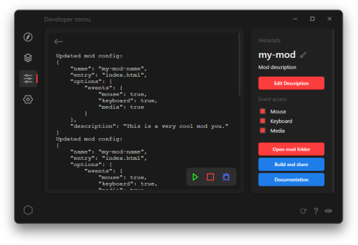

# Making a mod

Making wallpapers with HTML, CSS, and JS is easy with Octos. Follow this guide for a thorough introduction to making your own mod.

### Developer Menu

In the Octos app, navigate to the develop menu to access tools and resources to help you make your own mod. You can get started by creating a new mod or opening an existing mod folder.



### CLI

Alternatively, you can use the command line to initialize, test, and bundle your mod. In the command line, run `octos init [name]` to create a new mod.

[Learn more about using the CLI...](?t=using-the-cli)

## File structure
A basic mod folder looks like this:
```text
my-mod
| index.html
| mod.json
```
Store any files you need for your mod in a single folder containing a `mod.json` file. Change the `mod.json` to set mod settings and configure mod behavior.

A basic `mod.json` might look something like this:
```json
{
    "name": "My custom mod",
    "description": "A very cool mod I made that does very cool things",
    "entry": "index.html"
}
```
Change `"entry"` to the relative path to the HTML file or URL to a webpage that is rendered when a user starts up your mod.

[Learn more about mod.json...](?t=mod-json)

## Example
See an example of a simple wallpaper that shows some text in the middle of the screen.

`index.html`:
```html
<html>
<head>
    <style>
        html, body {
            height: 100%;
            background-color: white;
            text-align: center;
            line-height: 100vh;
        }
    </style>
</head>
<body>
    <h1>My very cool mod</h1>
</body>
</html>
```
`mod.json`:
```json
{
    "name": "My custom mod",
    "description": "A very cool mod I made that does very cool things",
    "entry": "index.html"
}
```

## Octos Native API
Use the Octos API to power up your wallpaper with any of the following:
- Get playback info
- Media/playback controls
- Read and write to local storage
- Access file system
- Read and write user preferences
- Access system information
- And more...

To get started, [check out the API Docs...](?t=using-the-api)

## Next steps

So you made a really cool mod. Now learn how to [test it](?t=testing), [package and share it](?t=packaging), and [publish it for the Explore page](?t=publishing).