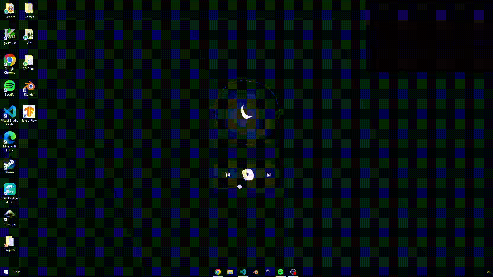
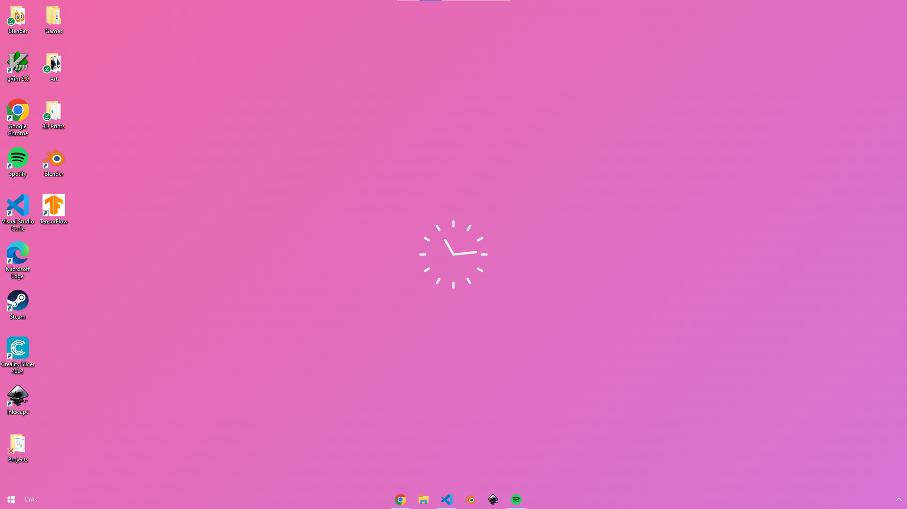

<h1>Octos - HTML Live Wallpaper Engine</h1>
<p>Create, distribute, and explore live, interactive wallpapers on Windows made with HTML, CSS, and JS.</p>
<div>


</div>

[API Documentation](https://underpig1.github.io/octos/docs/?t=installation) | [Installation](https://underpig1.github.io/octos/docs/?t=installation) | [Quickstart](https://underpig1.github.io/octos/docs/?t=quickstart)


## :construction: Thanks for testing out Octos!

Right now, Octos is in an early stage of development. To help out, consider [submitting a feature request or reporting an issue](https://github.com/underpig1/octos/issues/new). And of course, if you have an awesome wallpaper you made that you want to share, consider [publishing it](https://underpig1.github.io/octos/docs/?t=installation) on the platform. As always, check out the [API docs](https://underpig1.github.io/octos/docs/?t=installation) for resources and guides. Thanks!

# Installation

Download the Octos app for Windows.

# Gallery



### Ethereal
An interactive media player that ripples as your mouse passes over it.

<br>


### Terminal
A digital clock with a live old TV effect and customizable 3D text art.

<br>


### Image Background
Set your background to any image/gif/video and add widgets like a media controller, clock, and calender.

<br>



### Gradient
A simple analog desktop clock with a calming color-changing gradient background.

# Native API
Making your own live wallpaper is super easy with Octos' native API.

```html
<html>
    <body>
        <p>Now playing: <span id="song-title"></span></p>
        <button onclick="nextTrack()">Next track</button>

        <script src="https://unpkg.com/octos@latest/octos.js"></script>
        <script>
            const controller = new octos.MediaController();

            controller.on("track", (e) => {
                document.getElementById("song-title").innerText = e.title;
            });

            function nextTrack() {
                controller.send("next-track");
            }
        </script>
    </body>
</html>
```

Use the Octos API to:
- Get playback info
- Media/playback controls
- Read and write to local storage
- Access file system
- Read and write user preferences
- Access system information
- [Learn more with the API Docs]()

# Share your Wallpaper
Once you make your own awesome wallpaper, share it with the world.
