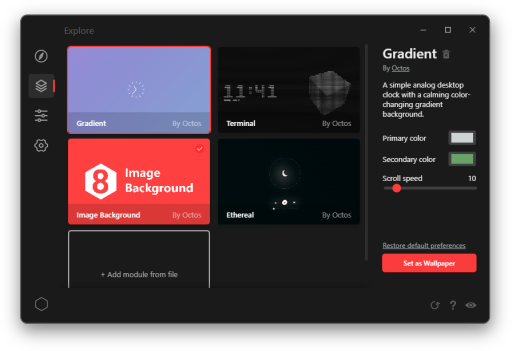

# Octos - HTML Live Wallpaper Engine
Create, distribute, and explore live, interactive wallpapers on Windows made with HTML, CSS, and JS.

[](https://github.com/underpig1/octos/actions/workflows/ci.yml)
[](https://github.com/underpig1/octos/actions/workflows/npm-publish.yml)
[](https://www.npmjs.com/package/octos)

[Documentation](https://underpig1.github.io/octos/docs/?t=installation) | [Installation](https://underpig1.github.io/octos/docs/?t=installation) | [Quickstart](https://underpig1.github.io/octos/docs/?t=quickstart)



## :construction: Pardon the mess: thanks for testing out Octos!

Octos is currently in an early stage of development. To help out, consider [submitting a feature request or reporting an issue](https://github.com/underpig1/octos/issues/new). And of course, if you have an awesome wallpaper you made that you want to share, consider [publishing it](https://underpig1.github.io/octos/docs/?t=publish) on the platform. As always, check out the [API docs](https://underpig1.github.io/octos/docs/?t=installation) for resources and guides. Thanks!

# Installation

> Download the Octos app for Windows (under construction)

Visit [releases](https://github.com/underpig1/octos/releases) to download the latest binaries. Note: your OS may give a Smartscreen warning. I haven't yet gotten around to certifying/signing the app. Right now, I just want to get your impressions and testing on the app, but in the next phase (soon) I'll be working on that as well as hopefully publishing to the Microsoft Store.

If you have npm, you can use it instead to just test out the app without installing.
Clone the repository and run `npm install` to install any dependencies and `npm start`.

# Usage

Once you install Octos, run the executable to start the app. When active, Octos lives in your system tray.


To see the quick access menu, right click on the tray icon. Here you can quickly switch between wallpapers, add a new one, and configure some settings. To pull up the Octos GUI, click the Octos icon in the tray or open up the menu and click Open.

The Octos app lets you explore community modules, view and manage your installed mods, create new mods for yourself or to share, and configure some app/system settings.

# Gallery

Here are some sample mods I threw together to demo the app's capabilities. All of them are available through the Octos app. [Contribute](https://underpig1.github.io/octos/docs/?t=publish)


### Ethereal
An interactive media player that ripples as your mouse passes over it.

The Octos API includes a media controller that allows mods to access playback info (like track title, artist, and track details) and send media requests like play and pause.

<br>


### Terminal
A digital clock with a live old TV effect and customizable 3D text art.

Live wallpapers depend on

<br>


### Image Background
Set your background to any image/gif/video and add widgets like a media controller, clock, and calender.

Octos has full mouse/keyboard support as well as local storage read/write access (with the Octos API) to preserve user preferences.

<br>


### Gradient
A simple analog desktop clock with a calming color-changing gradient background.

Making live wallpapers is simple with HTML, CSS, and JS. You can even embed a live website as your wallpaper.

# Native API
Making your own live wallpaper is super easy with Octos' native API.

```html
<html>
    <body>
        <p>Now playing: <span id="song-title"></span></p>
        <button onclick="nextTrack()">Next track</button>

        <script src="https://unpkg.com/octos@latest/octos.js"></script>
        <script>
            const controller = new octos.MediaController();

            controller.on("track", (e) => {
                document.getElementById("song-title").innerText = e.title;
            });

            function nextTrack() {
                controller.send("next-track");
            }
        </script>
    </body>
</html>
```

Use the Octos API to:
- Get playback info
- Media/playback controls
- Read and write to local storage
- Access file system
- Read and write user preferences
- Access system information
- [Learn more with the API Docs](https://underpig1.github.io/octos/docs/?t=using-api)

# Share your Wallpaper
Once you make your own awesome wallpaper, share it for other people to download from the Octos explore page.

See the [publishing guide](https://underpig1.github.io/octos/docs/?t=publish) for more details. Visit the [Octos community](https://github.com/underpig1/octos-community/tree/master) to see more mods available for download. 
